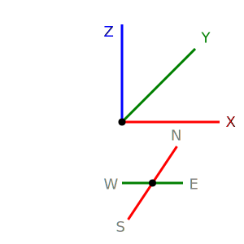
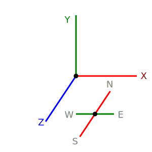

# System Overview

* The `Septopus Engine`'s role is to transform the Meta Septopus data on the blockchain into a 3D world. The Septopus engine can be thought of as a parser for on-chain data, implementing the Meta Septopus protocol and enabling interaction within a 3D virtual environment.

* The `Septopus Engine` is developed in **Javascript** and uses [three.js](https://threejs.org) for its rendering engine. It is released as open source and can be found on Github at [https://github.com/septopus-rex/world](https://github.com/septopus-rex/world).

* The `Septopus Engine` can be divided into two parts: the core system for building a first-person 3D environment, and the **adjuncts** for expanding its functionality.
  
## Basic Definition

* The Septopus Coordinate System is shown in the figure below. The X and Y axes are the horizontal plane where the player stands, and the Z axis is the direction of the sky. This is different from the default coordinate system of three.js.

|  Septopus Coordinate System   | Three.js Coordinate System  |
|  ----  | ----  |
|   |  |

* When drawing in 2D, the Septopus coordinate system uses the lower left corner as the origin and is counterclockwise, which is different from the browser page which uses the upper left corner as the origin and is clockwise.

* The default input unit for the `Septopus Engine` is meters (m). The system converts units by setting a conversion factor. The `Septopus Engine` displays units in millimeters (mm), and the system's conversion factor is 1000.
  
---

* The `Septopus Engine` provides a single program that supports the following operating modes for different purposes. This allows different types of players to play in the same 3D environment, lowering the user's cognitive threshold.

|  Mode   | Main Function  | Implementation |
|  ----  | ----  | ----  |
| Ghost  | Non-registered user mode, you can browse but not interact. | The main operating mode of meta septopus, you can walk around freely.  |
| Normal  | Registered user mode, you can use avatar. | The main operating mode of meta septopus, you can walk around freely.  |
| Edit  | The mode for editing block data can be only single one.  |  Separate the editing data and process it separately as task. |
| Game  | Pre-render all involved blocks, trigger is support. | Block datasource access and can only interact with the game server. |

---

* The `Septopus Engine` data structure design uses a variety of intermediate state standards, such as component data and input components. This allows it to adapt to different network storage and different rendering front-ends, improving the engine's compatibility. Data conversion is identified by shorthand notations. For example, the raw_std method in the appendix converts the raw data of the data source into standard data at runtime.

|  Data Name   | Main Function  | Save Location  | Abbreviated notation  |
|  ----  | ----  | ----  | ----  |
| Raw Data  | Streamlined, compressed data consisting of pure numbers | on-chain data from datasource | `raw` |
| Standard Data  | Convert from raw data and serves as the basis for conversion into other data. | Runtime  | `std` |
| Renderer Data  | Data converted from standard data and used for display rendering | Runtime  | `3d`,`2d`,`active` |
| Animation Data  | Implement common animation effects for different components, such as moving, scaling, deformation, etc. |  Runtime  | - |
| UI Data  | Data for the UI system to generate user operations. |  Adjuncts  | - |

---

* The `Septopus Engine` uses block to locate adjuncts. This creates two types of positioning: block coordinates (A coordinate system) and world coordinates (B coordinate system). Furthermore, the renderer output uses screen coordinates (C coordinate system). The data conversion between these three types of coordinates is implemented in different components.

|  Coordinate System   | Main Function  |  Abbreviated notation  |
|  ----  | ----  | ----  |
|  Block  | Compress data to make it easier to understand and copy and reuse. | `A`  |
|  World  | Splice block data, realize dynamic loading. | `B` |
|  Screen  | Used for display, accepting screen input. | `C` |

---

* The `Septopus Engine` leverages the unique characteristics of blockchain technology, calculating Septopus's independent time based on block height and adjusting Septopus's weather status based on block hashes. This allows data to have a time-based, presentable attribute. In the future, 3D objects can also be aged based on time. Alternatively, the sky can be displayed based on time and weather, achieving deep integration with blockchain data.

|  Name   | Main Function  |  Related Blockchain  | Scope  |
|  ----  | ----  | ----  | ----  |
| time  | Septopus's time system is defined by the general configuration | block height  | Player (age, etc.),Adjuncts (natural growth, etc.) |
| weather  | Septopus's weather system is defined by the general configuration | block hash  | Players (movement capacity, etc.), accessories (rendering effects, etc.) |

---

* The Septopus engine supports multiple blockchain networks, with contracts relying on external support and unrestricted by network constraints. The initial version was deployed on the Solana network, leveraging its convenient on-chain data storage and high-speed response times.

* The singleton mode is used for development, suitable for rendering in a single viewport, which is more suitable for Meta Septopus application scenarios and helps optimize performance. However, the problem is that when displaying Septopus content in multiple windows, the development complexity is relatively high.

## **Program Structure**

* The Septopus engine only needs to provide a DOM container to start the entire Meta Septopus system.
  
    ```Javascript
        import Engine from `septopus`;

        const DOM_ID="div_dom";
        const cfg={...};

        Engine.launch(DOM_ID,cfg,()=>{
            console.log(`Septopus World loaded successful.`);
        });
    ```

* The Septopus engine consists of the following components. Each component functions independently, creating a loosely coupled state. Major functional extensions come from dependencies. The framework is designed to provide a highly loosely coupled environment to facilitate adjunct development.

|  Component   | Main Function  | File Location  |
|  ----  | ----  | ----  |
| adjunct | 3D/2D data construction,data editing function,IO UI output,trigger tasks | `./adjunct/` |
| frame  | Block management, world management, components organization and management |  `./core/framework.js` |
| core  | World startup and management, time control, weather control, sky management, player control;|  `./core/` |
| renderer  | 3D renderer, 2D renderer |  `./render/` |
| controller  | 3D controller for PC and mobile, 2D controller for PC and mobile | `./control/` |
| IO  | Basic UI, blockchain network connection | `./io/` |
| lib  | General function library, data conversion function | `./lib/`,`./three/` |
| animation  | General animation effect implementation| `./effects/` |
| plugin  | Extended functionality |`./plugin/` |

* Because 3D operations involve performance bottlenecks, the Septopus engine uses frame-synchronized computing to synchronize the data and functions being processed with frame updates, reducing latency and ensuring smooth 3D operation. For example, when a resource needs to be loaded from the network, the data is persisted, with a network request made once per frame. If a data request is successful, the parsing of a single resource is also processed within each frame.

### Framework

* The framework part solves many functions such as data integration and code management.

|  Main Function   | Supplementary Notes  | File Location  |
|  ----  | ----  | ----  |
| Entry to run Meta Septopus | Septopus launch from here | `core/world.js` --> `VBW.world.first()` |
| Component registration | Mount component registration information, mount component method to `VBW` root, initialize `cache` data | `core/framework.js` --> `VBW.component` |
| Frame synchronization | Operation for frame synchronization, renderer update | `core/framework.js` --> `VBW.loop()` |
| Global Data |  Global data accessed by chain | `core/framework.js` --> `VBW.cache` |
| Mode Switching | Data adjustment in different modes  | `core/framework.js` --> `VBW.mode()` |
| Data Update | Components for obtaining data externally, mounted according to component type `datasource` | `core/framework.js` --> `VBW.datasource` |
| Configuration Management |  Read and mount all component configurations, define constants for reading and mounting | `core/framework.js` --> `VBW.setting` |
| Operating environment detection | Run device detection, Node attribute detection | `core/detect.js` |
| Block decoder |  Data conversion and update, edit menu | `core/block.js` |
| Event management |  Custom events, event binding and unbinding | `core/event.js` |
| Movement control |  Implementation of basic object movement, implementation of perspective transformation  | `core/movement.js` |
| Player management |  Running state saving, avatar management; | `core/player.js` |
| Time system |  Calculate Septopus time based on block height | `core/time.js` |
| Weather system |  Calculate Septopus weather characteristics based on block hash | `core/weather.js` |

### Renderer

|  Name   | Main Function  | File Location  | Mouting  |
|  ----  | ----  | ----  | ----  |
|  3D Renderer  |  Overall scene rendering; dynamic loading of blocks; | `render/render_3d.js`  |  `VBW.rd_three`  |
|  2D Renderer  | 2D map implementation; multi-dimensional view implementation  | `render/render_2d.js`  |  `VBW.rd_two`  |
|  Observe Renderer  | Independent component viewing, independent block viewing  | `render/render_observe.js`  |  `VBW.rd_observe`  |

### Controller

|  Name   | Main Function  | File Location  | Mouting  |
|  ----  | ----  | ----  | ----  |
|  3D FPV controller  |  Motion control, keyboard control implementation, screen touch operation implementation | `control/control_fpv.js`  |  `VBW.con_first`  |
|  2D map controller  |  Button control realization, screen control realization, output with different precision | `control/control_2d.js`  |  `VBW.con_two`  |
|  3D observe controller  |  3D object observation and screen control | `control/control_observe.js`  |  `VBW.con_observe`  |

### IO

|  Category   | Main Function  | File Location  | Mouting  |
|  ----  | ----  | ----  | ----  |
|  UI framework  | Different output methods are implemented, multiple input methods are implemented, UI framework duplication function  | `io/io_ui.js`  | - |
|  API management  | Multi-network data reading, contract request proxy, data subscription function implementation  | `io/api.js`  | `VBW.datasource` |

### Adjuncts

* Adjuncts are core components for system function expansion. The engine implements commonly used adjuncts, which are listed as follows:

|  Adjunct Name   | Main Function  | Details  |
|  ----  | ----  | ----  |
|  Box  | The simplest adjunct for easy understanding  | [Detail](../12-Adjunct/01-box.md)  |
|  Module  | Import external model adjunct to enrich the basic components of the content  | [Detail](../12-Adjunct/02-module.md)  |
|  Stop  | Basic adjunct, block the player's movement, raise the player's standing height  | [Detail](../12-Adjunct/03-stop.md)  |
|  Trigger  | Basic adjunct; build the core of the game, realize triggering in various 3D spaces, control the system and adjuncts | [Detail](../12-Adjunct/04-trigger.md)  |

### Plugin

|  Plugin Name   | Main Function  | File Location  | Mouting  |
|  ----  | ----  | ----  | ----  |
|  Link  | Display external links in 3D  | `io/plug_link.js`  | `VBW.plugin.link`  |
|  QR  | Display QR code in 3D, animation effect realization | `io/plug_qr.js`  | `VBW.plugin.qr` |

## Execution Logic

### Frame Processing

* In order to ensure smooth 3D operation, the system uses `frame processing` to solve the following asynchronous or large-scale computing situations.

|  Matters   | Causes of lag  | Solution  |
|  ----  | ----  | ----  |
|  Resource loading  | Delay of asynchronous network processing  |  Asynchronous processing does not block, and parsing continues after successful loading  |
|  Resource decoding  | Parsing resources such as models or images consumes a lot of resources  | Process data analysis one by one in `frame` |

* Frame processing is implemented by using a queue to cache tasks that need to be processed, and then processing the tasks in the queue one by one in the mounted frame synchronization method. This way, the calculation required to process a single frame is very limited, and there will be no lag.

### Form Output

* The standard input format is the data format passed to the UI to build the front-end input and output. Its format is as follows:

```Javascript
    {
        type:"number",                      //type of input
        key:"x",                            //key fo `stand editing format`
        value:std.x,                        //value of input
        label:"X",                          //label to show
        icon:"",                            //icon to show
        desc:"X of wall",                   //description of this input
        valid:(val,cvt)=>{                  //input valid checking function
            return valid.x(val,cvt,std)
        }
    }
   
```

### Editing Process

* Block is different from adjunct, but they also need to be displayed in the 3D world, so they also need to be edited. However, their data format is different from adjunct, but they are handled uniformly.

```Javascript
    {
        block:[2024,501],   //block to update
        action:"set",       //action, one of ["load","unload","set"]
        param:{
            elevation:2,    //parameter to set
        },
    }
```

* The standard editing format is the data standard transmitted to the adjunct for processing. Its format is as follows: Editing parameters are generated by the adjunct component and then processed by the adjunct component. Therefore, in addition to the basic parameters, it can support the key values ​​customized by the adjunct.

```Javascript
    {
        adjunct:"wall",         //name of adjunct
        action:"set",           //action one of ["set","add","remove"]，
        x:2025,                 //block X
        y:302,                  //block Y
        param:{ 
            x:2,                //STD_KEY --> Value
        },
        limit:["X","Y","Z"],    //limit of editing
    }
```

* When deletion occurs during editing, the order of the adjunct array will be changed, which may cause editing errors. The incoming operations need to be sorted and the deletion tasks should be executed last.

### Animation

* `Septopus Engine` supports the implementation of basic animations. You only need to return the animation format to achieve basic animation effects such as rotation, scaling, and movement.
  
* For complex animations, custom positions can be calculated by the adjunct.