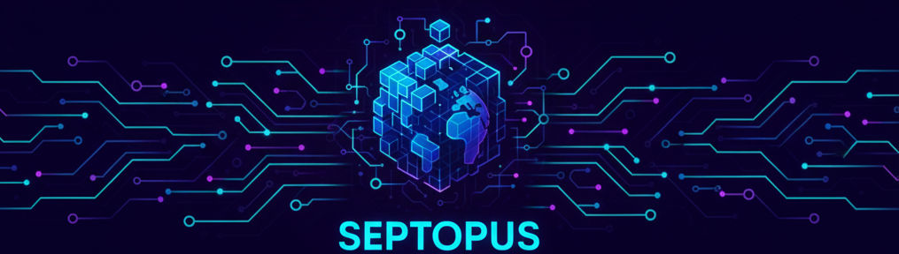

# Meta Septopus

* Homepage: [https://world.septopus.xyz](https://world.septopus.xyz)
* Demo: [https://world.septopus.xyz/demo](https://world.septopus.xyz/demo)
* Document: [http://localhost:3000/docs/world/](http://localhost:3000/docs/world/)
* Funding:

## Overview

* **Meta Septopus** is the cornerstone of the Septopus system, serving two purposes: first, to confirm Septopus participants, and second, to act as the main gateway for all Septopus activities.  
* **Meta Septopus** is designed as a completely decentralized system, featuring groundbreaking design in both its programs and data structure. From a data perspective, the **Meta Septopus** data definition is entirely open and publicly available on-chain. Even without the current parser (Virtual Block World), an identical virtual world can be reconstructed simply by adhering to the protocol. From a programmatic perspective, full on-chain deployment and open Adjunct development standards ensure that **Meta Septopus** is an open development world full of infinite possibilities.  
* **Meta Septopus** is a UGC (User-Generated Content) system where digital assets truly belong to the users. In **Meta Septopus**, users can own their own **Block** for a minimal fee (0.01 SOL), which can be traded or used to create engaging 3D content, or even a profitable game.  
* **Meta Septopus** adopts a tiered management system, where each **World** has its own **Owner**. The Owner can establish a unique worldview and create varied virtual environments by setting parameters and selecting authorized Adjuncts.  
* The **Adjunct** system in **Meta Septopus** is the primary method for extending the platform's functionality. Its streamlined and open structure simplifies 3D content development. **Adjunct** developers can profit from user purchases and licensing fees paid by the **World Owner**.  
* Once launched, **Meta Septopus** operates autonomously. The issuance of new Worlds requires no human intervention, a mechanism that ensures **Meta Septopus** achieves true decentralization. The self-consistent system can self-recover even in extreme scenarios, showcasing the robust vitality of decentralization.

## Funding

* Meta Septopus will issue 1 billion SPL Tokens and publicly sell 20% (200 million) of them at a price of 0.01U. The remaining 80% (800 million) will be locked up for 2 years, coinciding with the Spetopus Launch Period.
  
| Pie | Function | Lock |
| --- | --- | --- |
| 20% | Public sale, priced at 0.01U | -  |
| 20% | Septopus holds, Project's returns | 2 years |
| 60% | Meta Septopus holds | 2 years |
  
## **Economic Model**

* **Meta Septopus** uses **SOL** as the primary digital currency for transactions. World issuance, Block trading, and Adjunct payments are all conducted using SOL.  
* **Meta Septopus** issues its own Token, which operates independently and verifies the Septopus model for managing Projects.  
* **Meta Septopus** builds a multi-tiered, multi-participant virtual economy, where various roles can achieve profitability, extending beyond just **Block** sales.
  
### **World Mechanism**

* **Meta Septopus** is a self-running system, realized through the following issuance method:  
  1. The total number of **Worlds** issued is 100, Each world consists of 4096 * 4096 **Blocks**, with each Block measuring 16m * 16m in the physical world equivalent.  
  2. **World #0** is initiated for auction by the **King**, formally launching the autonomous **Meta Septopus**. Once the **World Owner** is confirmed, **Blocks** become available for purchase.  
  3. The default selling price for a **Block** is **0.01 SOL**. The sales revenue is split between the **World Owner** and **Meta Treasure** at a 5:5 ratio. Specifically, for every Block sold, the World Owner receives 0.005 SOL, and Meta Treasure receives 0.005 SOL.  
  4. When the sales rate reaches **60%**, the auction for the next World is triggered. The current World Owner may also modify the initial Block sales price. The revenue split with the Septopus Treasury remains unchanged, meaning the Septopus Treasury still receives 0.005 SOL for every Block sold.  
  5. After the new World's Owner is confirmed via auction, Block sales for that World also begin at a price of 0.01 SOL.  
* **Meta Septopus** primarily relies on content to sustain its long-term operation. Both the **World Owner** and the **Block Owner** are participants, creating a rich and varied virtual world through different roles and varied revenue streams.

### **World Auction**

* The **World** auction is divided into two phases to ensure a **World Owner** is generated: Phase 1 is a Dutch Auction, and Phase 2 is a Lottery Selection. If Phase 1 fails, the process proceeds to Phase 2.  
* **Phase 1: Dutch Auction**  
  1. A 1-week **Auctioneer Preparation** period is initiated. **Auctioneers** stake 10 SOL to join the **Auction Pool**, thereby gaining eligibility to participate and potentially become the **World Owner**.  
  2. One day after the Auctioneer Preparation phase ends, the auction begins, adopting a Dutch Auction format. The price starts at **1000 SOL** and linearly descends by **0.1 SOL** with each new Solana block, until it reaches **100 SOL**.  
  3. One day after the auction ends, Auctioneers can redeem their staked 10 SOL.  
  4. If the auction is successful, the Auctioneer pays the corresponding fee and becomes the official **World Owner**, and the World auction concludes.  
  5. If the auction fails, a new auction restarts one day later.  
  6. If three consecutive auctions fail, the process enters Phase 2: Lottery Selection.  
* **Phase 2: Lottery Selection**  
  1. A 1-week **Lottery Participant Preparation** period is initiated. **Lottery Participants** pay 1 SOL to join the **Lottery Pool**, gaining the right to be selected as the **World Owner**.  
  2. One day after the Lottery Participant Preparation phase ends, the **Drawing Block** height is determined based on the number of participants.  
  3. The block hash of the **Drawing Block** is subjected to **100 million SHA256 computations** to generate the final hash, which determines the winning participant, who becomes the **World Owner**. The World auction then concludes.  
* After a **World** begins sales, the auction for the next World is triggered when **80%** of its **Blocks** have been sold.

### **World Operation**

* The **World Owner** can configure on-chain data and set up Adjuncts to manage the presentation of the world, paying fees to the Adjunct developers.  
* The **World Owner** charges a **3%** transaction fee on **Block** trades, which is paid by the buyer.

### **Block Operation**

* **Blocks** are sold via self-determined pricing and involve the transfer of the Block and all its contained content. The sale will incur a transaction fee to the **World Owner**, paid by the buyer.  
* **Block Owners** can create content on their Block, including paid games, and directly earn revenue.
